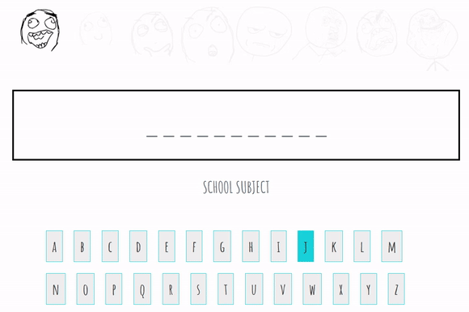

# Hangman

> This is a Javascript application that will entertain your free time. In this game you have to guess quotes in few categories.

## Setup

To run this project install it locally and open index.html live server using for example Visual Studio Code or Atom.

## Inspiration

This app is inspired by Kacper Sieradziński (https://www.udemy.com/course/programowanie-obiektowe-w-javascript/)
